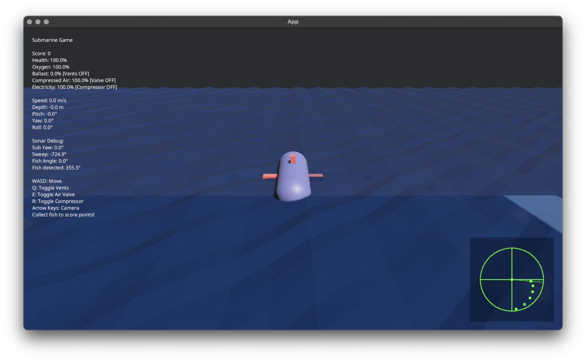

# 3D Submarine Game



A 3D submarine exploration game built with Rust and Bevy game engine featuring realistic ballast tank physics and underwater bubble effects.

## ✨ Features

- **🚢 3D Submarine Physics**: Realistic submarine movement with ballast tank system
- **🫧 Bubble Effects**: Visual air bubbles when venting ballast tanks underwater
- **🌊 Ballast System**:
  - **Q** - Toggle vents (water flows in, submarine sinks, bubbles appear)
  - **E** - Toggle air valve (compressed air pushes water out, submarine rises)
  - **R** - Toggle compressor (generates compressed air at surface only)
- **🐟 Fish Collection**: Collect fish to earn points and restore oxygen
- **🫁 Oxygen Management**: Manage your oxygen levels underwater
- **📡 Sonar System**: Active sonar with rotating sweep and fish detection
- **🏔️ Realistic Mountain-Bounded Lake Environment**: Vast underwater world surrounded by natural cone-shaped mountain ranges with realistic wave effects
- **⚡ Resource Management**: Electricity, compressed air, and ballast levels

## 🎮 Controls

### Movement
- **W/A/S/D**: Move submarine forward/left/backward/right
- **Arrow Keys**: Control camera angle

### Ballast & Systems
- **Q**: Toggle ballast vents (sink + bubbles when underwater)
- **E**: Toggle air valve (rise, uses compressed air)
- **R**: Toggle air compressor (surface only, uses electricity)

## 🌊 Game Mechanics

### Ballast Tank System
- **Empty Ballast (0%)**: Submarine is buoyant and rises
- **Full Ballast (100%)**: Submarine is heavy and sinks
- **Vents Open**: Water flows in, submarine sinks, **bubbles visible underwater**
- **Air Valve Open**: Compressed air pushes water out, submarine rises
- **No bubbles when ballast is full** - realistic physics!

### Resource Management
- **Compressed Air**: Generated by compressor at surface, consumed when blowing ballast
- **Electricity**: Powers compressor, recharges when compressor is off
- **Oxygen**: Depletes underwater, restored by collecting fish

### Realistic Physics
- **Buoyancy**: Constant upward force based on ballast level
- **Surface Operations**: Compressor only works at surface (Y ≤ 0)
- **Bubble Physics**: Bubbles only appear underwater and disappear at surface
- **Natural Cone Mountains**: Realistic cone-shaped peaks extending from sea floor to towering heights (50-160 units)
- **Mountain Clusters**: Natural peak groupings with satellite summits for authentic mountain range appearance
- **Layered Terrain**: Sea floor (-20 units) → underwater rocks → cone foothills → major peaks → tall mountain clusters
- **Expansive Lake**: Large crater lake environment (1200x1200 water surface) completely enclosed by mountain barriers
- **Extended Sonar Range**: 50-unit detection range for exploring the vast underwater world

## 🚀 Installation & Running

### Prerequisites
- [Rust](https://rustup.rs/) (latest stable version)
- Graphics drivers with OpenGL/Vulkan support

### Quick Start
```bash
# Clone the repository
git clone <repository-url>
cd submarine

# Run the game
cargo run --release

# For development with debug info
cargo run

# Enable physics debug wireframes
cargo run -- --debug-colliders
```

## 🔧 Dependencies

- **Bevy 0.12**: Modern 3D game engine
- **Bevy Rapier3D**: Physics simulation for realistic underwater movement
- **Clap**: Command-line argument parsing
- **Rand**: Random number generation for effects

## 🎯 Gameplay Tips

1. **Surface First**: Start at surface to ensure full compressed air
2. **Dive Carefully**: Open vents (Q) to let water in and dive
3. **Watch Resources**: Monitor compressed air and electricity levels
4. **Rise Strategically**: Use air valve (E) to blow ballast and surface
5. **Collect Fish**: Swim near fish to collect them for points and oxygen
6. **Bubble Watching**: Bubbles indicate active venting - use for visual feedback

## 🛠 Development

This game demonstrates:
- **ECS Architecture**: Bevy's Entity Component System
- **3D Physics**: Rapier physics integration
- **Real-time Rendering**: PBR materials and lighting
- **Game State Management**: Resource management and system coordination
- **Particle Effects**: Dynamic bubble spawning and animation

### Project Structure
```
submarine/
├── src/
│   └── lib.rs          # Main game logic
├── assets/
│   └── fonts/          # Game fonts
├── screenshots/        # Game screenshots
└── Cargo.toml         # Dependencies
```

## 🎮 Game Systems

- **Submarine Movement**: WASD controls with realistic physics
- **Ballast Control**: Toggle vents and air valve for depth control
- **Bubble System**: Spawns bubbles when air is vented underwater
- **Fish AI**: Autonomous fish movement with collection mechanics
- **Sonar Display**: Real-time fish detection and tracking
- **Camera System**: Smooth following camera with manual control
- **Wave Simulation**: Dynamic ocean surface with realistic waves

## 🔮 Future Enhancements

- **Advanced Sonar**: Multiple detection modes and range settings
- **Mission System**: Objectives and structured gameplay
- **Submarine Upgrades**: Enhanced systems and capabilities
- **Marine Life**: More diverse underwater creatures
- **Environmental Hazards**: Obstacles and challenges
- **Multiplayer**: Cooperative or competitive gameplay
- **Sound Design**: Immersive underwater audio
- **Weather Effects**: Dynamic ocean conditions

## 📜 License

This project is built for educational and demonstration purposes using the Rust programming language and Bevy game engine.

---

**🚢 Dive into the depths and explore the underwater world! 🌊**
